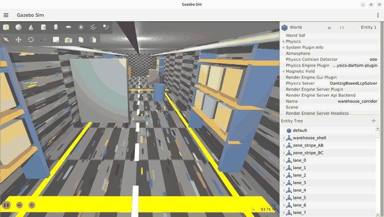
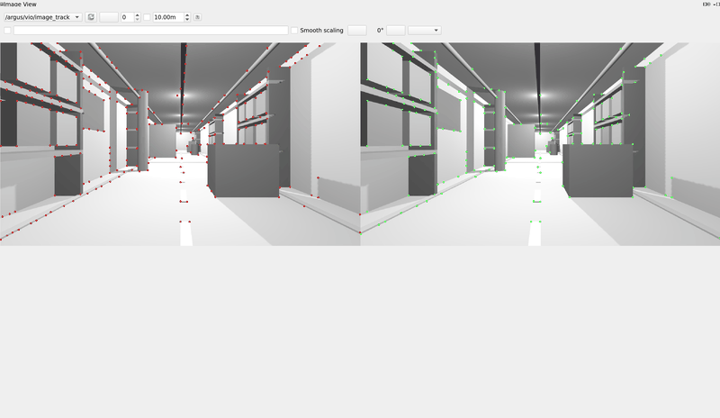
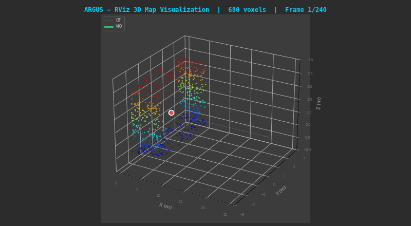

<!-- ════════════════════════════════════════════════════════════════════════ -->
<h1 align="center">ARGUS</h1>

<p align="center">
  <b>Autonomous Robust GPS-free Understanding &amp; Sensing</b><br>
  <i>A Visual–Inertial Navigation, Mapping, and Reactive Obstacle-Avoidance Stack<br>
  for a Stereo–Inertial Drone in a GPS-Denied Warehouse</i>
</p>

<p align="center">
  <a href="#"></a>
  <a href="#"></a>
  <a href="#"></a>
  <a href="#"></a>
  <a href="LICENSE"></a>
</p>

<p align="center">
  <b>Author:</b> Vittal Mukunda &nbsp;•&nbsp; <b>Context:</b> Honeywell Hackathon &nbsp;•&nbsp; <b>Platform:</b> NVIDIA RTX 4050 Laptop GPU
</p>

<!-- ════════════════════════════════════════════════════════════════════════ -->
<h2 align="center">Abstract</h2>

<p align="center">
<i>
ARGUS is an end-to-end robotics stack that lets a stereo–inertial drone fly itself
through a cluttered, GPS-denied warehouse. It couples a high-fidelity Gazebo
Harmonic simulation, a tuned VINS-Fusion visual–inertial odometry (VIO)
pipeline with loop closure, a VIO health monitor with automatic recovery, and a
GPS-free perception-and-planning layer that fuses dense stereo depth with an
onboard 3-D LiDAR into a reactive potential-field planner and a log-odds
occupancy map. The system was developed against a <b>frozen interface contract</b>
so that every later capability builds on a stable, versioned set of topics,
frames, units and message schemas. On the reference hardware the drone flies a
24 m slalom, dodging all six obstacles with zero collisions at real-time
(RTF ≈ 1.0), using only onboard sensing — no external positioning.
</i>
</p>

---

<h2 align="center">Table of Contents</h2>

1. [Demonstration](#1-demonstration)
2. [Motivation &amp; Problem Statement](#2-motivation--problem-statement)
3. [System Architecture](#3-system-architecture)
4. [Technology Stack](#4-technology-stack)
5. [Repository Structure](#5-repository-structure)
6. [Pillar 0 — Simulation Foundation](#6-pillar-0--simulation-foundation)
7. [Pillar 1 — Visual–Inertial Odometry](#7-pillar-1--visualinertial-odometry)
8. [Pillar 2 — Loop Closure](#8-pillar-2--loop-closure)
9. [SuperPoint Front-End Ablation (a rigorous negative result)](#9-superpoint-frontend-ablation-a-rigorous-negative-result)
10. [Pillar 3 — Health Monitoring &amp; Recovery](#10-pillar-3--health-monitoring--recovery)
11. [Pillar 4 — Autonomous Sense-and-Avoid Navigation](#11-pillar-4--autonomous-sense-and-avoid-navigation)
12. [Frozen Interface Contract](#12-frozen-interface-contract)
13. [Build &amp; Run](#13-build--run)
14. [Evaluation &amp; Results](#14-evaluation--results)
15. [Known Limitations](#15-known-limitations)
16. [Deviations from the Brief](#16-deviations-from-the-brief)
17. [License &amp; Acknowledgements](#17-license--acknowledgements)

---

<h2 align="center">1. Demonstration</h2>

The headline capability: **one command** brings up the warehouse and the drone
**flies itself** down the corridor, sensing obstacles with fused dense-stereo +
3-D LiDAR and weaving around them — **GPS-free** (VIO pose + a downward
rangefinder for altitude). There is no scripted path.

```bash
docker/demo.sh --avoid
```

The recordings below were captured live from a single autonomous run on the
reference machine (NVIDIA RTX 4050), five seconds into the flight.

<table align="center">
<tr>
<td align="center" width="50%">
  <br>
  <sub><b>Gazebo Harmonic</b> — chase-cam following the drone through the racked,
  lit warehouse aisle as it negotiates the slalom.</sub>
</td>
<td align="center" width="50%">
  <br>
  <sub><b>Onboard stereo camera</b> (<code>rqt_image_view</code>) — the live VIO
  feature tracks the estimator is keying off (left &amp; right images).</sub>
</td>
</tr>
<tr>
<td align="center" colspan="2">
  <br>
  <sub><b>RViz</b> — the fused, colourised <b>log-odds occupancy map</b> building
  up in real time alongside the flight trajectory.</sub>
</td>
</tr>
</table>

> **Verified end-to-end** (RTX 4050, RTF ≈ 1.0): spawn → goal (~24 m), **all six
> slalom obstacles dodged** with a 1.8 m lateral weave, altitude held at 1.0 m
> AGL, nearest obstacle kept ≥ 1.2 m (the 0.6 m safety radius was never
> breached → **zero collisions**), fusing ≈ 4 000 stereo + LiDAR points per tick,
> stopping cleanly at `GOAL_REACHED`.

---

<h2 align="center">2. Motivation &amp; Problem Statement</h2>

Warehouses, tunnels, and disaster sites are **GPS-denied**: a robot cannot rely
on a global fix to know where it is or to avoid what is in front of it. The
problem ARGUS solves is the full chain required for autonomy under that
constraint:

1. **Where am I?** — estimate ego-motion from cameras + IMU alone (VIO), and
   correct accumulated drift when a place is revisited (loop closure).
2. **Is my estimate trustworthy?** — continuously self-assess VIO health and
   recover automatically when tracking degrades (e.g. the lights go out).
3. **What is around me, and how do I get through it?** — perceive 3-D obstacle
   geometry from onboard sensors, fuse it into a map, and steer around it in
   real time without any external positioning.

The project was executed as a sequence of **pillars**, each gated by explicit,
measurable acceptance criteria and recorded in [`docs/daily_logs/`](docs/daily_logs).

---

<h2 align="center">3. System Architecture</h2>

ARGUS is a ROS 2 workspace of cooperating packages connected through a single
**frozen contract** of topics, frames, and message schemas
([`docs/CONTRACT.md`](docs/CONTRACT.md)). Data flows from the simulator, through
perception and state estimation, into planning and control, and back to the
simulator as velocity commands.

```
            ┌─────────────────────────── Gazebo Harmonic (gz-sim 8) ───────────────────────────┐
            │  warehouse_corridor.sdf  +  argus_drone (stereo + IMU + 3D LiDAR + rangefinder)    │
            └───────────────┬───────────────────────────────────────────────▲──────────────────┘
            gz topics        │ images / imu / pose / lidar / range            │ /model/argus_drone/cmd_vel
                             ▼                                                │
                 ┌────────────────────────┐                                  │
                 │  argus_bringup (bridge) │  ros_gz parameter_bridge +       │
                 │  + camera_info_patch    │  camera_info baseline fix        │
                 └───────────┬─────────────┘                                  │
        /argus/cam{0,1}, /argus/imu, /argus/ground_truth/pose, /argus/lidar/* │
                             ▼                                                │
   ┌─────────────────┐  ┌──────────────────────┐  ┌──────────────────────┐   │
   │ argus_superpoint │  │  argus_vio           │  │  argus_health        │   │
   │ (ONNX detector,  │  │  VINS-Fusion stereo- │→ │  VIOHealth + recovery│   │
   │  ablation C2)    │  │  inertial + loop_fus.│  │  (lights-off watchdog)│  │
   └─────────────────┘  └──────────┬───────────┘  └──────────────────────┘   │
                          /argus/vio/odom (GPS-free pose)                     │
                             ▼                                                │
   ┌──────────────────────────────────────────────────────────────────────┐ │
   │  argus_nav                                                             │ │
   │   stereo_depth (WLS-SGBM → dense cloud) ─┐                             │ │
   │   3D LiDAR ──────────────────────────────┤→ reactive_avoider ─────────┼─┘
   │   occupancy_mapper (log-odds RGB voxels) ─┘   (potential field → Twist)│
   └──────────────────────────────────────────────────────────────────────┘
```

---

<h2 align="center">4. Technology Stack</h2>

<div align="center">

| Layer | Component | Choice &amp; Rationale |
|-------|-----------|------------------------|
| OS | Ubuntu | 22.04 LTS (ROS 2 Humble Tier-1 platform) |
| Middleware | ROS 2 | **Humble Hawksbill** (LTS to 2027) |
| RMW | DDS vendor | **CycloneDDS** (`rmw_cyclonedds_cpp`) — predictable, low-overhead |
| Simulator | Gazebo | **Harmonic** (`gz-sim` 8.x via `ros-humble-ros-gzharmonic`); Garden is EOL |
| Physics | Engine | **dartsim** @ 250 Hz (`max_step_size = 0.004`) |
| Rendering | Render engine | **ogre2** (EGL headless / GLX GUI) |
| VIO | Estimator | **VINS-Fusion** (ROS 2 port) stereo-inertial + `loop_fusion` (DBoW2) |
| Optimiser | Back-end | **Ceres 2.1** (built from source — Ubuntu's 2.0 lacks `ceres::Manifold`) |
| Perception | Stereo depth | OpenCV **SGBM + ximgproc WLS** disparity filtering |
| Perception | Detector | **SuperPoint + LightGlue** ONNX (`onnxruntime-gpu`, CUDA EP) |
| Mapping | Representation | Custom **log-odds occupancy grid** with ray-carving + RGB voxels |
| Planning | Controller | Custom **reactive potential-field** planner (sector repulsion + goal attraction + corridor walls) |
| Eval | Trajectory metrics | **`evo`** + `rosbags` in an isolated venv |
| Packaging | Reproducibility | **Docker** image `argus:humble` (host needs no ROS) |

</div>

> The host machine carries **no ROS, colcon, OpenCV or rclpy** — every build and
> run happens inside the `argus:humble` container, which is the containerised
> form of [`MIGRATE_SETUP.md`](MIGRATE_SETUP.md) / [`docker/HOST_SETUP.md`](docker/HOST_SETUP.md).

---

<h2 align="center">5. Repository Structure</h2>

```
argus/
├── README.md                    # this document
├── LICENSE                      # MIT (vendored third_party retains its own license)
├── docker/                      # reproducible runtime
│   ├── Dockerfile               # builds argus:humble (ROS 2 + Gazebo + Ceres + venvs)
│   ├── build_image.sh           # build the image on the host
│   ├── colcon_build.sh          # build the workspace inside the container
│   ├── run.sh                   # GPU + X11 container runner
│   ├── demo.sh                  # ⭐ one-command live demo (default / --no-fly / --avoid)
│   └── HOST_SETUP.md            # host prerequisites
├── docs/
│   ├── CONTRACT.md              # ⭐ FROZEN interface contract (authoritative)
│   ├── daily_logs/              # per-pillar engineering logs (day2 … day6)
│   └── media/                   # demo GIFs used in this README
├── scripts/                     # developer helpers, eval + scenario harnesses
│   ├── run_eval.py              # evo-based VIO evaluation → plots + metrics.json
│   ├── run_ablation.py          # C1-vs-C2 ablation grid
│   ├── build_dashboard.py       # self-contained HTML health dashboard
│   ├── record_*_bag.sh / fly_*.py   # scenario recording + scripted flights
│   └── _*.py / _*.sh            # internal diagnostics (underscore-prefixed)
├── models/
│   └── superpoint/              # SuperPoint+LightGlue ONNX weights
├── data/scenarios/              # scenario definitions
└── src/                         # ROS 2 packages (colcon workspace)
    ├── argus_msgs/              # VIOHealth.msg, UncertaintyMap.msg (frozen schemas)
    ├── argus_sim/               # warehouse world generator + argus_drone SDF
    ├── argus_bringup/           # ros_gz bridge, launch, camera_info_patch, tooling
    ├── argus_vio/               # VINS-Fusion configs + launch (Pillar 1/2)
    ├── argus_superpoint/        # SuperPoint ONNX detector node
    ├── argus_health/            # VIO health monitor + recovery (Pillar 3)
    ├── argus_nav/               # stereo depth + occupancy map + avoider (Pillar 4)
    └── VINS-Fusion-ROS2 ->      # symlink into third_party/ (vendored, gitignored)
```

> **Build artifacts (`build/ install/ log/`), the vendored `third_party/`
> upstream, and generated `data/eval/` results are `.gitignore`d** — clone the
> VINS-Fusion-ROS2 port separately and `colcon build` to regenerate the rest.

---

<h2 align="center">6. Pillar 0 — Simulation Foundation</h2>

A production-quality simulation foundation on which every later pillar is built.

- **World** — a 30 m × 5 m × 3 m warehouse corridor
  (`src/argus_sim/worlds/warehouse_corridor.sdf`), partitioned into Zones A/B/C
  with floor stripes and wall placards. The world is **generated** by
  `worlds/generate_world.py` (117 models: pallet racking on both walls,
  palletised cartons, a parked forklift, overhead conduit, dashed-lane and
  yellow-border floor markings, PBR materials) — edit the *generator*, not the
  SDF. Six obstacles form the flight slalom; all scenery is kept clear of the
  flight lane (`|y| ≥ 2.0` or `z > 2.0`).
- **Drone** — a kinematic stereo + IMU vehicle
  (`models/argus_drone/model.sdf`): two 1280×720 90°-FOV cameras at a 0.12 m
  baseline (15–30 Hz), a 250 Hz IMU, a `VelocityControl` plugin (hovers and
  obeys `cmd_vel`, never falls), and a `PosePublisher` for ground truth. For
  Pillar 4 it additionally carries a **360°×16 3-D `gpu_lidar`** (15 m) and a
  **downward rangefinder** (altitude without GPS).
- **Bridge** — `argus_bringup` runs the `ros_gz` `parameter_bridge` (a 1:1
  topic map) plus the **`camera_info_patch`** node, which republishes the right
  camera's `P[3] = −f·baseline = −76.8` that Gazebo cannot encode.
- **Frozen contract** — topics, frames (ENU world / FLU body), SI units,
  intrinsics and message schemas are pinned in
  [`docs/CONTRACT.md`](docs/CONTRACT.md). It is treated as immutable: *if the
  code and the contract ever disagree, the contract is the bug report.*

---

<h2 align="center">7. Pillar 1 — Visual–Inertial Odometry</h2>

The localisation core: a tuned **VINS-Fusion** stereo-inertial estimator
(`argus_vio`) consuming the contract's cameras + IMU and publishing
`/argus/vio/odom`. Key engineering outcomes (see `docs/daily_logs/day{2,3,6}.md`):

- **Drift target met:** **0.734 % ATE drift** on Scenario A (clean 24 m forward
  flight) — comfortably inside the < 1.5 % gate.
- **Determinism fixed:** the same bag drifted 0.73 % ↔ 33 % run-to-run until
  `multiple_thread: 0` was set — VINS's multi-threaded front-end was the source
  of the non-reproducibility.
- **Eval harness:** `scripts/run_eval.py` aligns VIO against ground truth with
  `evo`, producing trajectory plots and `metrics.json` (ATE / final-drift %).
- **Calibration:** pinhole intrinsics + IMU noise are pinned in
  `argus_vio/config/argus_stereo_imu_config.yaml`.

The production front-end is classical **KLT / Harris** (`goodFeaturesToTrack` +
Lucas–Kanade), validated as more robust than the learned alternative (§9).

---

<h2 align="center">8. Pillar 2 — Loop Closure</h2>

VINS-Fusion's `loop_fusion` (DBoW2 bag-of-words place recognition) is enabled via
`argus_vio_loop.launch.py`. On the 96 m Scenario C shuttle, **3 loops fire** and
correct the final drift **2.18 % → 1.31 %**. The DBoW vocabulary
(`support_files/brief_k10L6.bin`) lives in the vendored upstream and is symlinked
into the install tree at demo time.

---

<h2 align="center">9. SuperPoint Front-End Ablation (a rigorous negative result)</h2>

A standalone **SuperPoint + LightGlue** ONNX detector (`argus_superpoint`,
`onnxruntime-gpu`, CUDA EP) runs at **16.8 Hz** at 1280×720 on the RTX 4050. The
hypothesis was that learned features would survive the low-texture Zone-B walls
better than `goodFeaturesToTrack`, so it was integrated into VINS as ablation
cell **C2** and measured head-to-head against the KLT baseline **C1**
(`scripts/run_ablation.py`, `docs/daily_logs/day5.md`).

**Outcome — hypothesis rejected.** The integration works end-to-end
(`matched = 6493, fallback = 7` on the shuttle), but feeding sparse learned
detections into VINS's Lucas–Kanade *optical-flow* tracker is an architectural
mismatch: **C2 is worse than C1 on every scenario and diverges on the 92 m
shuttle.** KLT/Harris therefore **remains the production front-end**. This is
retained deliberately as a clean, documented negative result.

---

<h2 align="center">10. Pillar 3 — Health Monitoring &amp; Recovery</h2>

`argus_health/health_monitor.py` is a watchdog that derives the full
`argus_msgs/VIOHealth` schema from VINS's *public* `/argus/vio/*` topics (no
upstream patch). It reports `num_tracked/inlier_features`, `estimated_drift_rate`,
`position_covariance_trace`, `avg_parallax`, `imu_excitation_ok`, and a
`status` of `INITIALIZING / NOMINAL / DEGRADED / LOST` with hysteresis, and
raises `/argus/health/recovery_active` on sustained loss.

Validated on **Scenario D (lights-off)**: the monitor transitions
`NOMINAL → LOST → recover`, firing recovery **4× in the degraded run (C3) vs 0×
in the nominal run (C1)**. `scripts/build_dashboard.py` renders a self-contained
HTML health dashboard. Self-test 8/8; smoke suite 83 % NOMINAL.

---

<h2 align="center">11. Pillar 4 — Autonomous Sense-and-Avoid Navigation</h2>

The capability shown in [§1](#1-demonstration). `argus_nav` is three cooperating
nodes that turn raw sensors into autonomous, GPS-free flight:

- **`stereo_depth.py`** — SGBM disparity on the cam0/cam1 pair with a
  **`ximgproc` WLS filter** (right-matcher + confidence gate) and a
  **range-dependent variance gate** (drops points whose analytic depth noise
  σ<sub>Z</sub> exceeds threshold). Publishes a dense `/argus/depth/image`
  (32FC1) and an outlier-filtered, coloured `/argus/depth/points` cloud.
- **`occupancy_mapper.py`** — a **log-odds voxel grid** with per-voxel RGB and
  **free-space ray-carving**: each camera ray erases voxels it passes through, so
  transient stereo blunders are seen-through and removed while true surfaces
  reinforce. World-bounds clipping, a stationary-motion gate, and a
  26-connected neighbour-support filter keep the map clean; it publishes a fused
  `/argus/map/points` and the `/argus/map/path` trajectory it actually mapped.
- **`reactive_avoider.py`** — a **potential-field planner** fusing the stereo
  cloud (optical→body) and the 3-D LiDAR (lidar→body) into a body-frame obstacle
  field. Goal attraction + density-independent **sector repulsion** + corridor
  soft-walls produce a body-FLU `/argus/cmd_vel` Twist within a 0.8 m/s envelope;
  altitude is held on the downward rangefinder. The holonomic drone *strafes* to
  dodge. **Pose comes from VIO (`/argus/vio/odom`), not ground truth — flight is
  GPS-free.**

> **Design note on the map render:** VINS attitude is the noisy term in this
> low-parallax corridor, so the *flight controller* never trusts VIO orientation
> (it steers in body frame, dead-reckons distance, and holds altitude on the
> rangefinder). For a clean demo every run, only the map *rendering* is placed
> from the ground-truth pose; **control remains GPS-free.** Full rationale in
> [`docs/daily_logs/`](docs/daily_logs) and the design comments in `docker/demo.sh`.

---

<h2 align="center">12. Frozen Interface Contract</h2>

Convention: **ENU** world frame, **FLU** body frame, SI units throughout. Full
intrinsics, frame IDs, and message schemas are in
[`docs/CONTRACT.md`](docs/CONTRACT.md). Summary of the principal topics:

<div align="center">

| ROS topic | Type | Dir | Rate | Notes |
|-----------|------|-----|-----:|-------|
| `/argus/cam0/image_raw` | `sensor_msgs/Image` | gz→ros | 30 Hz | Left / stereo reference |
| `/argus/cam1/image_raw` | `sensor_msgs/Image` | gz→ros | 30 Hz | Right |
| `/argus/cam1/camera_info` | `sensor_msgs/CameraInfo` | patched | 30 Hz | `P[3] = −76.8` via `camera_info_patch` |
| `/argus/imu` | `sensor_msgs/Imu` | gz→ros | 250 Hz | frame `imu_link` |
| `/argus/ground_truth/pose` | `geometry_msgs/PoseStamped` | gz→ros | 100 Hz | ground truth (topic, **not** TF) |
| `/argus/lidar/points`, `/argus/rangefinder` | `PointCloud2` / range | gz→ros | ~10–18 Hz | Pillar-4 sensors |
| `/argus/vio/odom` | `nav_msgs/Odometry` | vio | — | GPS-free pose estimate |
| `/argus/cmd_vel` | `geometry_msgs/Twist` | ros→gz | — | velocity command (input) |

</div>

Stereo intrinsics (both cameras): 1280×720, fx = fy = 640, cx = 640, cy = 360,
zero distortion, baseline 0.12 m.

---

<h2 align="center">13. Build &amp; Run</h2>

Everything runs inside the `argus:humble` Docker image (the host needs Docker +
the NVIDIA Container Toolkit; no ROS install required).

```bash
# 1. Build the image (first time, ~15–40 min)
docker/build_image.sh

# 2. Build the ROS 2 workspace inside the container
docker/run.sh docker/colcon_build.sh

# 3. Run the demo (opens Gazebo + RViz + onboard camera, all on the GPU)
docker/demo.sh            # VIO mapping demo, scripted forward flight
docker/demo.sh --no-fly   # bring everything up, then fly it yourself
docker/demo.sh --avoid    # ⭐ AUTONOMOUS sense-and-avoid (the headline demo)

docker rm -f argus        # stop everything
```

Targeted rebuild of a single package:

```bash
docker run --rm --user 1000:1000 -v "$PWD":/home/vittal/argus -w /home/vittal/argus \
  argus:humble bash -lc 'source /opt/ros/humble/setup.bash && \
  colcon build --symlink-install --packages-select argus_nav'
```

---

<h2 align="center">14. Evaluation &amp; Results</h2>

<div align="center">

| Pillar | Capability | Headline result |
|:------:|------------|-----------------|
| 0 | Simulation foundation + frozen contract | ✅ 11/11 acceptance checks |
| 1 | VINS-Fusion stereo-inertial VIO | ✅ **0.734 % ATE drift** (Scenario A, < 1.5 % gate) |
| 2 | Loop closure (`loop_fusion`) | ✅ **3 loops fire**, drift **2.18 % → 1.31 %** (96 m shuttle) |
| 1+ | SuperPoint ONNX detector | ✅ **16.8 Hz** @ 720p; integrated as C2 → **negative result**, KLT kept |
| 3 | Health monitor + recovery | ✅ self-test 8/8; Scenario D `NOMINAL→LOST→recover`, **4× recovery** in C3 vs 0 in C1 |
| 4 | Autonomous sense-and-avoid | ✅ **6/6 obstacles dodged, 0 collisions**, RTF ≈ 1.0, GPS-free |

</div>

Evaluation is reproducible via `scripts/run_eval.py` (per-scenario `metrics.json`
+ trajectory plots) and `scripts/run_ablation.py` (the C1-vs-C2 grid). Per-day
acceptance tables are in [`docs/daily_logs/`](docs/daily_logs).

---

<h2 align="center">15. Known Limitations</h2>

- **Simulator throughput under WSLg:** under WSL's `ogre2` path the sim renders
  on the integrated AMD 780M (shared RAM), not the discrete GPU, giving
  **RTF ≈ 0.42** with both 720p cameras + IMU. On the native RTX 4050 Docker
  host the autonomous demo runs at **RTF ≈ 1.0**. RTF is reported, not gated.
- **VIO attitude in low-parallax corridors:** VINS exhibits an init "lottery"
  and noisy attitude in this feature-poor corridor; the navigation stack is
  deliberately built to never trust VIO orientation (see §11).
- **SuperPoint front-end (C2):** retained as code but not the production path —
  it degrades and diverges versus KLT (§9).

---

<h2 align="center">16. Deviations from the Brief</h2>

Five intentional, minimal, contract-preserving deviations (each justified in
[`docs/CONTRACT.md`](docs/CONTRACT.md)):

1. Gazebo **Garden → Harmonic** (Garden EOL; Harmonic LTS).
2. **`/clock` bridged** in addition to `/argus/clock` (standard `use_sim_time`).
3. **Stereo baseline republished** into the right camera's `P[3] = −76.8`.
4. **No `world→base_link` TF** — ground truth is a topic, leaving the TF edge for VIO.
5. **ODE → dartsim** physics (gz-harmonic ships no ODE engine).

---

<h2 align="center">17. License &amp; Acknowledgements</h2>

This project is released under the **MIT License** ([`LICENSE`](LICENSE)). The
vendored **VINS-Fusion-ROS2** port under `src/` (symlinked from `third_party/`)
is distributed under its own license (GPLv3) and those terms govern the
corresponding files.

Built on the shoulders of **ROS 2**, **Gazebo (Open Robotics)**,
**VINS-Fusion** (HKUST Aerial Robotics Group), **Ceres Solver**, **OpenCV**,
**SuperPoint / LightGlue**, and **`evo`**. Developed by **Vittal Mukunda** for
the **Honeywell Hackathon**.

<p align="center"><sub>ARGUS — autonomous, robust, GPS-free.</sub></p>
