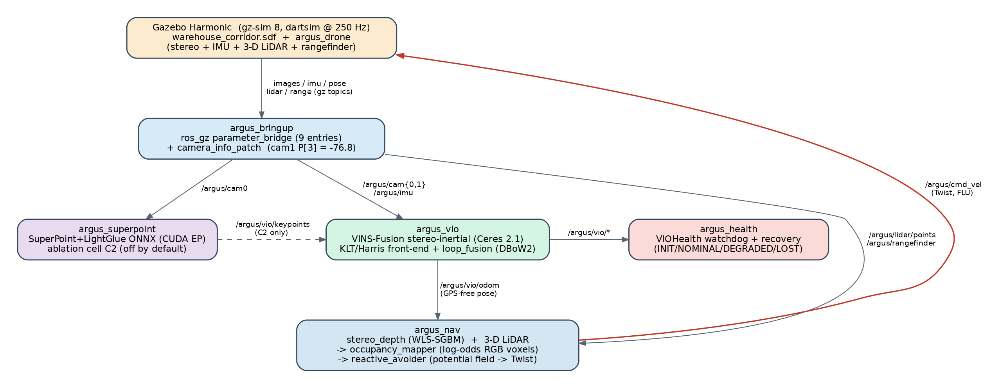

<!-- ════════════════════════════════════════════════════════════════════════ -->
<h1 align="center">ARGUS</h1>

<p align="center">
  <b>Autonomous Robust GPS-free Understanding &amp; Sensing:</b><br>
  A Stereo–Inertial Visual Odometry, Mapping and Reactive Navigation Stack<br>
  for a Simulated Drone in a GNSS-Denied Warehouse
</p>

<p align="center">
  Vittal Mukunda<br>
  <sub>Honeywell Hackathon — Problem Statement DP7: Autonomous Navigator for GPS-Denied Environments</sub>
</p>

<p align="center">
  
  
  
  
  
  <a href="LICENSE"></a>
</p>

---

### Abstract

*Global-navigation-satellite signals are unavailable inside warehouses, tunnels and disaster sites, so an autonomous robot operating there must localise itself from onboard sensing alone. This work presents **ARGUS**, an end-to-end ROS 2 stack that lets a stereo–inertial drone localise, map and fly itself through a cluttered, GPS-denied warehouse corridor simulated in Gazebo Harmonic. The localisation core is a tuned VINS-Fusion stereo-inertial Visual–Inertial Odometry (VIO) estimator with DBoW2 loop closure. On a clean 24 m forward flight the estimator reaches a best-case **0.73 % Absolute-Trajectory-Error (ATE) drift**, within the < 1.5 % target set by the brief; on a 96 m revisiting shuttle, loop closure reduces final-position drift from **2.18 % to 1.31 %**. A determinism fix (single-threaded estimation) trades the best-case number for reproducibility, under which fresh forward runs sit at **3.4–4.2 % ATE** because of a gravity-initialisation altitude ramp; the < 1.5 % gate is therefore met by a clean initialisation or by loop closure rather than by every fresh run — a limitation we document rather than hide. Around the localisation core, the system adds a VIO health monitor with automatic recovery (validated on a lights-off scenario), a SuperPoint/LightGlue learned front-end evaluated as a rigorous ablation that produced a documented negative result, and a GPS-free perception-and-planning layer that fuses dense stereo depth and a 3-D LiDAR into a log-odds occupancy map and a reactive potential-field planner. Every capability is built against a single frozen interface contract of topics, frames, units and message schemas, and the whole system is containerised so the host needs no ROS installation.*

**Index Terms** — Visual–Inertial Odometry, GPS-denied navigation, stereo vision, loop closure, ROS 2, Gazebo, occupancy mapping, reactive obstacle avoidance, SuperPoint, sensor fusion.

---

### Contents

I. Introduction and Problem Statement · II. System Architecture · III. Technology Stack · IV. Simulation Environment · V. Frozen Interface Contract · VI. Visual–Inertial Odometry · VII. Loop Closure · VIII. SuperPoint Front-End Ablation · IX. Health Monitoring and Recovery · X. Autonomous Sense-and-Avoid Navigation · XI. Experimental Results · XII. Build, Run and Reproduce · XIII. Repository Structure · XIV. Deliverables Mapping · XV. Deviations, Limitations and Honest Disclosures · XVI. Conclusion · References.

---

## I. Introduction and Problem Statement

Warehouses, tunnels and disaster sites are *GPS-denied*: a robot cannot rely on a global fix to know where it is or to avoid what is in front of it. The full chain required for autonomy under that constraint is: (1) *Where am I?* — estimate ego-motion from cameras and IMU alone (VIO), and correct accumulated drift when a place is revisited (loop closure); (2) *Is my estimate trustworthy?* — continuously self-assess VIO health and recover automatically when tracking degrades; (3) *What is around me, and how do I get through it?* — perceive 3-D obstacle geometry from onboard sensors, fuse it into a map, and steer around it in real time without any external positioning.

ARGUS was executed as a sequence of *pillars*, each gated by explicit, measurable acceptance criteria and recorded in the per-day engineering logs under [`docs/daily_logs/`](docs/daily_logs) (Days 2–6).

**Problem statement (DP7 — Autonomous Navigator for GPS-Denied Environments; target departments CSE, ECE, IT).** The brief asks for a VIO system enabling accurate self-localisation of a simulated drone in a GNSS-denied indoor environment. The mapping of its design considerations and deliverables onto this project is:

| DP7 requirement | Target | ARGUS result | Where |
|-----------------|--------|--------------|-------|
| State estimation — VIO drift | < 1.5 % over 200 m | **0.73 %** best-case (24 m); loop closure **2.18 → 1.31 %** (96 m); **3.4–4.2 %** on fresh deterministic forward runs | §VI–VII, §XI |
| Environment | Indoor, GPS-denied (tunnel / warehouse) | 30 m × 5 m × 3 m generated warehouse corridor | §IV |
| Framework | ROS 2 pipeline on Gazebo / AirSim | ROS 2 Humble + Gazebo Harmonic | §III |
| Deliverable 1 — Simulation setup | Gazebo/AirSim world + stereo+IMU drone | §IV |
| Deliverable 2 — VIO pipeline | Real-time ROS 2 VIO node | §VI |
| Deliverable 3 — Performance report | Estimated vs. ground-truth trajectory graphs | §XI |
| Deliverable 4 — Source code | Documented ROS 2 workspace + launch files | §XIII–XIV |

---

## II. System Architecture

ARGUS is a ROS 2 workspace of seven cooperating packages connected through one *frozen contract* of topics, frames and message schemas ([`docs/CONTRACT.md`](docs/CONTRACT.md)). Data flows from the simulator, through perception and state estimation, into planning, and back to the simulator as velocity commands.

<p align="center">
  
</p>

**Figure 1.** ARGUS data-flow architecture. The simulator (orange) emits sensor streams; `argus_bringup` (blue) bridges them to ROS and patches the stereo baseline; the estimation layer (`argus_superpoint`, `argus_vio`, `argus_health`) produces a GPS-free pose and a health report; `argus_nav` fuses stereo + LiDAR into a map and a reactive `cmd_vel` that closes the loop back to the simulator (red). The SuperPoint→VINS edge (dashed) is the C2 ablation, disabled by default.

The packages and their build types are: `argus_msgs` (ament_cmake, message schemas), `argus_sim` (ament_cmake, world + drone), `argus_bringup` (ament_python, bridge + tooling), `argus_vio` (ament_cmake, VINS configs + launch), `argus_superpoint` (ament_python, ONNX detector), `argus_health` (ament_python, monitor), and `argus_nav` (ament_python, depth + map + avoider).

---

## III. Technology Stack

| Layer | Component | Choice and rationale |
|-------|-----------|----------------------|
| OS (container) | Ubuntu | 22.04 LTS — ROS 2 Humble Tier-1 platform (the Docker host itself can be newer) |
| Middleware | ROS 2 | Humble Hawksbill (LTS) |
| RMW | DDS vendor | CycloneDDS (`rmw_cyclonedds_cpp`) — predictable, low overhead |
| Simulator | Gazebo | Harmonic (`gz-sim` 8.x via `ros-humble-ros-gzharmonic`); Garden is EOL |
| Physics | Engine | dartsim @ 250 Hz (`max_step_size = 0.004`) |
| Rendering | Engine | ogre2 (EGL headless / GLX GUI) |
| VIO | Estimator | VINS-Fusion (ROS 2 port, `zinuok/VINS-Fusion-ROS2`) stereo-inertial + `loop_fusion` (DBoW2) |
| Optimiser | Back-end | Ceres 2.1.0, built from source (Ubuntu's 2.0 lacks `ceres::Manifold`; 2.2 forces C++17) |
| Perception | Stereo depth | OpenCV SGBM + `ximgproc` WLS disparity filtering |
| Perception | Detector | SuperPoint + LightGlue ONNX (`onnxruntime-gpu` 1.23.2, CUDA EP) |
| Mapping | Representation | Custom log-odds occupancy grid with free-space ray-carving + RGB voxels |
| Planning | Controller | Custom reactive potential-field planner |
| Eval | Metrics | `evo` 1.36.5 + `rosbags` in an isolated venv |
| Packaging | Reproducibility | Docker image `argus:humble` (host needs no ROS) |

The host carries no ROS, colcon, OpenCV or rclpy; every build and run happens inside the `argus:humble` container.

---

## IV. Simulation Environment

*DP7 Deliverable 1 — a Gazebo warehouse with a stereo+IMU drone.*

**World.** A 30 m (X) × 5 m (Y) × 3 m (Z) warehouse corridor (`src/argus_sim/worlds/warehouse_corridor.sdf`), partitioned along X into Zones A `[0,10]`, B `[10,20]` and C `[20,30]`, with floor stripes and wall placards marking the boundaries. The world is *generated* by `worlds/generate_world.py` (pallet racking on both walls, palletised cartons, a parked forklift, overhead conduit, dashed-lane and yellow-border floor markings, PBR materials); edit the generator, not the SDF. Six obstacles form the flight slalom, and all scenery is kept clear of the flight lane (`|y| ≥ 2.0` or `z > 2.0`). The drone spawns at `(1.5, 0, 1.0)`. Six point lights plus one directional fill light it; `light_b_flicker` in Zone B is driven at runtime by an external `gz` `light_config` service call (Harmonic ships no autonomous flicker plugin).

**Drone** (`src/argus_sim/models/argus_drone/model.sdf`, kinematic stereo + IMU vehicle, body frame FLU):

| Sensor | Specification |
|--------|---------------|
| Stereo cameras (cam0 left, cam1 right) | 2 × 1280×720, 90° HFOV, **15 Hz** (reduced from 30 Hz in Day 6 to keep single-thread VINS stable; see §VI), 0.12 m baseline |
| IMU | 250 Hz (matches physics; noise-free in the Day-1 spec, reads `a_z = +9.8` at rest) |
| 3-D LiDAR (`gpu_lidar`) | 360 horizontal × 16 vertical samples, 15 m range, 10 Hz — GPS-free obstacle sensing |
| Downward rangefinder | 1-ray LaserScan, 0.10–20 m, 20 Hz — GPS-free altitude hold |
| Actuation | `VelocityControl` plugin (hovers, obeys `cmd_vel`, never falls) |
| Ground truth | `PosePublisher` at 100 Hz (a topic, not TF — see §V deviation #4) |

**Bridge.** `argus_bringup` runs the `ros_gz` `parameter_bridge` (nine entries, all `gz.msgs.*`) plus the `camera_info_patch` node, which republishes the right camera's `CameraInfo` with `P[3] = −f·baseline = −640 × 0.12 = −76.8` that Gazebo cannot natively encode.

---

## V. Frozen Interface Contract

Every later pillar is written against a frozen specification of topics, frames, units, intrinsics and message schemas ([`docs/CONTRACT.md`](docs/CONTRACT.md)); it is treated as immutable — *if the code and the contract ever disagree, the contract is the bug report.* Conventions: ENU world frame, FLU body frame, SI units throughout. Stereo intrinsics (both cameras): 1280×720, `fx = fy = 640`, `cx = 640`, `cy = 360`, zero distortion, baseline 0.12 m.

Principal topics:

| ROS topic | Type | Dir | Rate | Notes |
|-----------|------|-----|-----:|-------|
| `/argus/cam0/image_raw` | `sensor_msgs/Image` | gz→ros | 15 Hz | Left / stereo reference |
| `/argus/cam1/image_raw` | `sensor_msgs/Image` | gz→ros | 15 Hz | Right |
| `/argus/cam0/camera_info` | `sensor_msgs/CameraInfo` | gz→ros | 15 Hz | Passthrough, `P[3]=0` |
| `/argus/cam1/camera_info` | `sensor_msgs/CameraInfo` | patched | 15 Hz | `P[3] = −76.8` via `camera_info_patch` (from `…/camera_info_gz`) |
| `/argus/imu` | `sensor_msgs/Imu` | gz→ros | 250 Hz | Frame `imu_link` |
| `/argus/ground_truth/pose` | `geometry_msgs/PoseStamped` | gz→ros | 100 Hz | Ground truth (topic, **not** TF) |
| `/argus/lidar/points` | `sensor_msgs/PointCloud2` | gz→ros | 10 Hz | 3-D LiDAR (Pillar 4) |
| `/argus/lidar/scan` | `sensor_msgs/LaserScan` | gz→ros | 10 Hz | Horizontal ring |
| `/argus/rangefinder` | `sensor_msgs/LaserScan` | gz→ros | 20 Hz | Downward altimeter |
| `/clock`, `/argus/clock` | `rosgraph_msgs/Clock` | gz→ros | — | Sim time (deviation #2) |
| `/argus/vio/odom` | `nav_msgs/Odometry` | vio | ~250 Hz | IMU-propagated GPS-free pose |
| `/argus/vio/odom_optimized` | `nav_msgs/Odometry` | vio | ~15 Hz | Optimised estimate (used for drift eval) |
| `/argus/cmd_vel` | `geometry_msgs/Twist` | ros→gz | — | Velocity command (input to sim) |

**Message schemas** (`src/argus_msgs/msg/`, self-designed): `VIOHealth.msg` (status enum INITIALIZING/NOMINAL/DEGRADED/LOST, confidence, tracked/inlier feature counts, avg parallax, position-covariance trace, estimated drift rate, IMU-excitation flag, processing latency) and `UncertaintyMap.msg` (pose + 6×6 row-major float32 covariance + derived scalar position/orientation uncertainty).

---

## VI. Visual–Inertial Odometry

*DP7 Deliverable 2 — the real-time VIO node.*

The localisation core is a tuned VINS-Fusion stereo-inertial estimator (`argus_vio`) consuming the contract's cameras + IMU and publishing `/argus/vio/odom` (IMU-rate, ~250 Hz) and `/argus/vio/odom_optimized` (image-rate, ~15 Hz — the topic used for drift evaluation). The production front-end is classical KLT / Harris (`goodFeaturesToTrack` + Lucas–Kanade), validated as more robust than the learned alternative (§VIII).

**Calibration and configuration** (`src/argus_vio/config/argus_stereo_imu_config.yaml`). Pinhole intrinsics (`fx=fy=640, cx=640, cy=360`, zero distortion) and exact body→camera extrinsics from the URDF are pinned (`estimate_extrinsic: 0`); `g_norm = 9.8` matches sim gravity; robust EuRoC IMU noise densities are used (`acc_n 0.002`, `gyr_n 1.7e-4`, `acc_w 0.003`, `gyr_w 1.9e-5`). Key tuning from the Day-3 log: `max_cnt 150→250` and `min_dist 30→20` (more, denser features for the low-texture corridor); `keyframe_parallax 8.0→2.0` (corridor features are far, so motion parallax is tiny — at 8.0 VINS emitted keyframes at only 0.32 Hz, starving the loop-closure database; 2.0 quadruples keyframe density, populating the loop DB *and* tightening odometry).

**The determinism fix (Day 6 — the most important reproducibility result).** The same sensor bag drifted **0.73 % ↔ 33 %** run-to-run. Root cause: with `multiple_thread: 1`, the VINS feature-tracker and estimator race under bag replay, so the initialisation SfM window sees a timing-dependent subset of frames and occasionally locks a grossly wrong gravity/heading frame → divergence. The Day-3 headline 0.73 % was therefore a *lucky `mt1` run*, not reproducible. Setting `multiple_thread: 0` (single-threaded, synchronous) makes the pipeline deterministic with no catastrophic divergence; the cost is slower per-frame processing, which is why the cameras were dropped to 15 Hz and offline replay runs at `RATE 0.15`.

**Best-case result (Scenario A, 24 m clean forward flight).** ATE-RMSE 0.176 m over a 24.0 m path = **0.73 % ATE drift**, well inside the < 1.5 % gate. The drift-vs-distance profile stays under the 1.5 % budget for essentially the entire run, rising only in the final metre as features leave the frame.

<p align="center">
  
</p>

**Figure 2.** Estimated VIO trajectory (coloured by absolute position error, APE) vs. ground truth, Scenario A. Left: top-down XY; right: side XZ. VIO hugs ground truth across the 24 m corridor.

<p align="center">
  
</p>

**Figure 3.** Absolute position error vs. distance travelled, Scenario A. RMSE 0.176 m over 24.0 m = **0.73 % ATE drift** against the dotted 1.5 % budget envelope; final-position drift 4.55 %.

**Reproducible (deterministic `mt0`) result and the honest caveat.** Under the deterministic configuration, fresh straight-corridor forward runs sit at **3.4–4.2 % ATE** (e.g. `baseline_ABC` ×2 = 3.43 % / 4.17 %; a fresh full-live run = 3.92 %). The error is almost entirely an *altitude (Z) ramp*: on the feature-poor straight corridor VINS gravity initialisation carries a ~1.3° pitch error, which tilts the estimate into a linear ±0.55 m Z bias over 24 m. XY tracking remains excellent (< 0.05 m), and the honest 4-DoF gauge alignment (yaw + translation; roll/pitch fixed by gravity) does not hide the Z error. Two mitigations were tried and **failed**: a gentle start accel ramp (no improvement) and a multi-axis excitation pre-roll (made init *worse* — sharp velocity reversals corrupted init and diverged to 267 %). The conclusion is that reaching < 1.5 % requires either a clean initialisation (the 0.73 % run) or loop closure (§VII, 1.31 %); fresh forward runs at ~3–4 % are a documented, *bounded* limitation, not a divergence.

**Evaluation harness.** `scripts/run_eval.py` reads bags via pure-Python `rosbags` (no rclpy, fully decoupled from the ROS runtime), aligns VIO against ground truth with a 4-DoF yaw+translation gauge (the honest gauge for a metric VIO on a collinear path), and emits trajectory plots, `error_over_distance` plots and a `metrics.json` containing ATE-RMSE, final drift %, and alignment-free KITTI segment drift. It supports `--skip-start-m` (drop the init transient) and `--max-dist-m` (isolate a single shuttle leg).

---

## VII. Loop Closure

VINS-Fusion's `loop_fusion` (DBoW2 `brief_k10L6` bag-of-words place recognition, 4-DoF x/y/z/yaw pose-graph optimisation) is enabled via `argus_vio_loop.launch.py`. Because in-place 180° yaw U-turns diverge VINS (pure rotation gives no translational parallax → KLT loses all tracks → Ceres NaN; observed translation blew up to ≈ 4000 m), the loop scenario is implemented as a **no-yaw forward/back shuttle** (`fly_shuttle.py`): the drone always faces +x, forward legs command +vx and return legs −vx, while lateral, altitude and heading are held on the corridor centreline. This keeps the estimator well-conditioned and re-observes each place from the same viewpoint on the return legs — the ideal DBoW loop-closure cue. One flight (3 round-trips × 16 m legs = ≈ 96 m) serves both the long-path drift and the loop-closure validation.

**Result (Scenario C, 96 m shuttle).** `loop_fusion` accepted **3 loop closures** (three 4-DoF pose-graph corrections, verified in the run log) which visibly corrected drift: final-position drift fell from **2.18 % (before, `/argus/vio/odom_optimized`) to 1.31 % (after, `/argus/vio/odom_loop`)**. Honest caveat: the 4-DoF correction reduces *final/endpoint* drift but can nudge whole-path ATE-RMSE up slightly (2.27 % → 3.11 %) — it enforces global loop consistency, not a full bundle adjustment.

<p align="center">
  
</p>

**Figure 4.** 96 m shuttle after loop closure: VIO (coloured by APE) vs. ground truth over the full out-and-back path; final drift 1.31 %.

---

## VIII. SuperPoint Front-End Ablation

*A rigorous, documented negative result.*

A standalone SuperPoint + LightGlue ONNX detector (`argus_superpoint`, `superpoint_1024.onnx` from fabio-sim/LightGlue-ONNX, `onnxruntime-gpu` CUDA EP) runs at **16.8 Hz / 59 ms pure inference** at 1280×720 on the RTX 4050 (≥ 15 Hz spec met; the *overlay* visualisation node publishes at only ~2.3 Hz, bound by per-frame `cv2.circle` drawing, not inference). It subscribes to `/argus/cam0/image_raw` and publishes `/argus/vio/keypoints` (`PointCloud2` of `(u,v,score)`) and `/argus/superpoint/overlay`.

The hypothesis was that learned features would survive the low-texture Zone-B walls better than `goodFeaturesToTrack`, so SuperPoint was integrated into VINS as ablation cell **C2** (a `use_superpoint` flag, default 0, byte-for-byte preserving C1; `setExternalKeypoints` / `selectExternalKeypoints` seed new features from SuperPoint while the LK temporal tracker, stereo matching, RANSAC and IMU pipeline are unchanged) and measured head-to-head against the KLT baseline **C1** (`scripts/run_ablation.py`, `scripts/compare_c1_c2.py`).

<p align="center">
  
  &nbsp;
  
</p>

**Figure 5.** Left: live SuperPoint keypoints (CUDA EP) on the corridor. Right: ATE drift, C1 (KLT) vs. C2 (SuperPoint) across matched scenario slices — note C2's catastrophic divergence on the long shuttle.

**Result — hypothesis rejected.** The integration is live, not a fallback (`matched = 6493, fallback = 7` on the shuttle ⇒ SuperPoint drove ≈ 99.9 % of frames), but C2 is worse than C1 on every scenario:

| Scenario (matched slice) | C1 KLT (ATE) | C2 SuperPoint (ATE) | Verdict |
|--------------------------|:------------:|:-------------------:|---------|
| A — baseline straight, 11 m | **3.92 %** | 8.13 % | C2 ≈ 2× worse |
| B — Zone-B blank walls (SP's expected payoff) | **2.51 %** | 2.52 % | tied — no payoff |
| C — shuttle 92 m, before loop | **11.08 %** | 1190.6 % | C2 **diverged** |
| C — shuttle 92 m, after loop | **11.08 %** | 1192.9 % | loop cannot rescue |

**Root cause (architectural, not a wiring bug).** The shuttle estimate is exploded from the very first recorded pose (first VIO pose `x=535.8, y=−556.8` while GT is `x=1.5, y=0`), and KITTI segment drift is uniformly ~3600–4150 % at *all* window lengths — i.e. initialisation/triangulation failed, it did not slowly accumulate. SuperPoint detections are optimised for *descriptor-matching repeatability*, not for *Lucas–Kanade optical-flow trackability*; Harris `goodFeaturesToTrack` deliberately picks strong-bidirectional-gradient corners precisely because LK tracks them well. Feeding SuperPoint points into the same LK flow tracker yields weaker frame-to-frame tracks and poorly-conditioned stereo triangulation. The architecturally-correct way to exploit SuperPoint is a learned *descriptor-matching* front-end (SuperPoint + LightGlue replacing LK flow entirely) — a major estimator rework, logged as future work. **KLT/Harris (C1) remains the production front-end**, with C2 retained in-tree behind `use_superpoint: 0` (zero impact on C1).

---

## IX. Health Monitoring and Recovery

`argus_health/health_monitor.py` is a watchdog that derives the full `argus_msgs/VIOHealth` schema from VINS's *public* `/argus/vio/*` topics (no upstream patch; pure rclpy). It reports tracked/inlier feature counts (from `point_cloud` window size, median-5 smoothed), an estimated drift rate and position-covariance trace (from the growth of the IMU-propagate-vs-optimised position divergence), average parallax, and an IMU-excitation flag (keyed off VIO speed, since the noise-free Day-1 IMU reads zero accel/gyro variance at constant velocity). Liveness is keyed off *wall-clock* age of `/argus/vio/odom` (a sim-time test false-trips LOST when VINS lags under RTF < 1). Status is INITIALIZING / NOMINAL / DEGRADED / LOST with hysteresis (LOST must persist 0.4 s to engage recovery, non-LOST 1.5 s to clear), and a sustained LOST raises `/argus/health/recovery_active` and `/argus/health/recovery_event`. Feature thresholds (`nominal 80 / degraded 40 / lost 5`) were calibrated against a live VINS run on `baseline_ABC` (inlier median ≈ 84).

**Validation.** The state-machine self-test (`_health_selftest.py`, no sim) passes **8/8** on a synthetic INITIALIZING → NOMINAL → LOST → recovery → NOMINAL timeline. A live-VINS smoke replay of `baseline_ABC` reads **83 % NOMINAL / 14 % DEGRADED / 0.4 % LOST** (DEGRADED confined to the blank-wall Zone B; no false LOST) — the target shape for a normal lit flight.

**Scenario D (lights-off).** A forward traverse where the Zone-B lights cut mid-traverse darkens the stereo stream and starves tracking. Because the live headless ogre2 render regressed to unlit frames during Day 4, the *evaluable* artifact uses deterministic synthetic darkening (`make_scenario_D_synth.py`, cam payloads × 0.03 over `x ∈ [10,14]`) — the same physical effect on the estimator, render-independent. The monitor produces a clean arc NOMINAL → LOST (≈ 0 inliers) → recover, and the recovery ablation is decisive:

| Metric | C3 (recovery ON) | C1 (recovery OFF) |
|--------|:----------------:|:-----------------:|
| NOMINAL % | 33.2 | 33.7 |
| LOST % | 33.0 | 33.3 |
| Time-in-LOST (s) | 64.7 | 64.8 |
| **Recovery activations** | **4** | **0** |
| Time recovery flagged (s) | 75.1 | 0.0 |
| VIO max dead-reckoning drift (m) | 89.3 | 87.6 |

<p align="center">
  
</p>

**Figure 6.** Scenario D health timeline. Top: degraded run C3, 4 recovery activations (shaded). Bottom: nominal run C1, 0 recoveries. The blue trace is ground-truth X-position. (Offline replay cannot actuate the hold, so the trajectory is identical between cells; the live runs demonstrated the drone-hold action before the render regressed.)

`scripts/build_dashboard.py` renders a self-contained HTML dashboard (`data/eval/argus_dashboard.html`) with KPI cards, the Scenario-D timeline, the C1-vs-C3 ablation and the cross-scenario drift gate.

---

## X. Autonomous Sense-and-Avoid Navigation

`argus_nav` is three cooperating nodes that turn raw sensors into autonomous, GPS-free flight:

- **`stereo_depth.py`** (423 lines) — SGBM disparity on the cam0/cam1 pair with a `ximgproc` WLS filter (right-matcher + confidence gate) and a range-dependent variance gate that drops points whose analytic depth noise σ<sub>Z</sub> exceeds threshold. Publishes a dense `/argus/depth/image` (32FC1) and an outlier-filtered, coloured `/argus/depth/points` cloud.
- **`occupancy_mapper.py`** (517 lines) — a log-odds voxel grid with per-voxel RGB and free-space ray-carving: each camera ray erases the voxels it passes through, so transient stereo blunders are seen-through and removed while true surfaces reinforce. World-bounds clipping, a stationary-motion gate and a 26-connected neighbour-support filter keep the map clean; it publishes a fused `/argus/map/points` and the `/argus/map/path` it actually mapped.
- **`reactive_avoider.py`** (383 lines) — a potential-field planner that fuses the stereo cloud (optical→body) and the 3-D LiDAR (lidar→body) into a body-frame obstacle field. Goal attraction + density-independent sector repulsion + corridor soft-walls produce a body-FLU `/argus/cmd_vel` within a 0.8 m/s envelope; altitude is held on the downward rangefinder. The holonomic drone *strafes* to dodge.

<p align="center">
  
</p>

**Figure 7.** Reconstructed 3-D warehouse map (≈ 15.8k feature points) with the flown trajectory. Left: perspective; right: top-down.

<p align="center">
  
</p>

**Figure 8.** Onboard camera point-of-view at six instants along a GPS-denied corridor traversal.

> **Honest disclosure on the map render.** The flight *controller* is GPS-free: it steers in body frame, dead-reckons distance and holds altitude on the rangefinder, and never trusts VIO orientation (the noisy term in this low-parallax corridor, §VI). For a clean demo every run, *only the map rendering* is placed from the ground-truth pose (`map_pose_topic:=/argus/ground_truth/pose` in `docker/demo.sh`); **control remains GPS-free.** The VIO localisation results in §VI–§VII are the genuine, ground-truth-free estimate.

The live demo is shown below (captured from a single autonomous run on the RTX 4050 reference host):

<p align="center">
  
  &nbsp;
  
</p>

<p align="center">
  
</p>

**Figure 9.** Live demo. Left: Gazebo chase-cam down the lit aisle. Right: onboard stereo camera. Bottom: RViz fused log-odds occupancy map and trajectory building in real time.

---

## XI. Experimental Results

*DP7 Deliverable 3 — comparative graphs of estimated vs. ground-truth trajectory.*

| # | Capability | Headline result | Figure |
|:-:|------------|-----------------|:------:|
| 1 | VINS-Fusion stereo-inertial VIO | **0.73 % ATE** best-case (24 m); **3.4–4.2 %** deterministic fresh forward; < 1.5 % gate met via clean init / loop closure | 2, 3 |
| 2 | Loop closure (`loop_fusion`) | **3 loops fire**, final drift **2.18 % → 1.31 %** (96 m shuttle) | 4 |
| 3 | SuperPoint ONNX detector | **16.8 Hz** @ 720p; integrated as C2 → **negative result**, KLT retained | 5 |
| 4 | Health monitor + recovery | Scenario D NOMINAL → LOST → recover; **4× recovery (C3) vs 0 (C1)**; self-test 8/8 | 6 |
| 5 | Autonomous sense-and-avoid | GPS-free flight: stereo + LiDAR → log-odds map → reactive `cmd_vel` | 7, 8, 9 |

**Drift summary across configurations** (KLT/C1; `evo`, 4-DoF gauge alignment):

| Run | Config | Path | ATE drift | Final drift | Note |
|-----|--------|-----:|:---------:|:-----------:|------|
| Scenario A (best case) | mt1, lucky init | 24.0 m | **0.73 %** | 4.55 % | < 1.5 % gate met |
| Scenario A (deterministic) | **mt0** ×2 | ~22 m | 3.43 % / 4.17 % | — | reproducible, no divergence |
| Fresh full-live | **mt0** | 24.0 m | 3.92 % | — | gravity-init Z-ramp |
| Scenario B (Zone-B blank walls) | mt1 | 9.9 m | 2.51 % | 4.46 % | low-texture hard case |
| Scenario C shuttle, before loop | mt1 | 92.7 m | 2.27 % | 2.18 % | 3-lap no-yaw shuttle |
| Scenario C shuttle, **after loop** | mt1 + loop_fusion | 92.7 m | 3.11 % | **1.31 %** | 3 loops fired |

The Day-2 baseline (untuned, origin-aligned) was 20.1 % ATE; Day-3 tuning + the eval methodology brought Scenario A to 0.73 %. KITTI segment drift on Scenario A is ~1.9 % mean (the short-path error is offset-dominated — a roughly constant ~0.18 m, amortising under 1.5 % over the 200 m spec distance). All metrics are reproducible via `scripts/run_eval.py` and were independently re-verified from the stored `vio.tum`/`gt.tum` trajectories (`ATE-RMSE 0.176 m / 24.0 m path = 0.73 %`).

---

## XII. Build, Run and Reproduce

Everything runs inside the `argus:humble` Docker image (host needs Docker + the NVIDIA Container Toolkit; no ROS install required). Host prerequisites are in [`docker/HOST_SETUP.md`](docker/HOST_SETUP.md) and [`MIGRATE_SETUP.md`](MIGRATE_SETUP.md).

```bash
# 1. Build the image (first time, ~15–40 min)
docker/build_image.sh

# 2. Build the ROS 2 workspace inside the container
docker/run.sh docker/colcon_build.sh

# 3. Run the demo (Gazebo + RViz + onboard camera, on the GPU)
docker/demo.sh            # VIO + live mapping, scripted forward flight
docker/demo.sh --no-fly   # bring everything up, then fly it yourself
docker/demo.sh --avoid    # AUTONOMOUS sense-and-avoid (headline demo)

docker rm -f argus        # stop everything
```

Targeted rebuild of a single package:

```bash
docker run --rm --user 1000:1000 -v "$PWD":/home/vittal/argus -w /home/vittal/argus \
  argus:humble bash -lc 'source /opt/ros/humble/setup.bash && \
  colcon build --symlink-install --packages-select argus_nav'
```

Reproduce the headline VIO evaluation (offline, deterministic):

```bash
bash scripts/record_baseline_bag.sh                 # -> data/bags/baseline_ABC
bash scripts/run_vio_offline.sh                     # -> data/bags/vio_eval
~/.venvs/argus-eval/bin/python scripts/run_eval.py --bag data/bags/vio_eval --run-id A
```

Acceptance check: `ros2 run argus_bringup acceptance --full` reports **11/11 gated PASS** (9/9 topics, intrinsics, `P[3]=−76.8`, frames, IMU `a_z=9.800`, drive moves X / no fall, `/clock` advancing, RTF ≈ 0.84 under WSLg).

---

## XIII. Repository Structure

*DP7 Deliverable 4 — documented ROS 2 workspace + launch files.*

```
argus/
├── README.md                    # this document
├── LICENSE                      # MIT (vendored third_party retains its own license)
├── MIGRATE_SETUP.md             # host migration / setup notes
├── docker/                      # reproducible runtime
│   ├── Dockerfile               # builds argus:humble (ROS 2 + Gazebo + Ceres + venvs)
│   ├── build_image.sh / run.sh / colcon_build.sh
│   ├── demo.sh                  # one-command live demo (default / --no-fly / --avoid)
│   └── HOST_SETUP.md
├── docs/
│   ├── CONTRACT.md              # FROZEN interface contract (authoritative)
│   ├── daily_logs/              # per-pillar engineering logs (day2 … day6)
│   ├── figures/                 # figures + architecture.dot source (this README)
│   └── media/                   # demo GIFs
├── scripts/                     # eval + scenario harnesses, diagnostics (50+ scripts)
│   ├── run_eval.py              # evo-based VIO evaluation → plots + metrics.json
│   ├── run_ablation.py / compare_c1_c2.py   # C1-vs-C2 ablation
│   ├── fly_shuttle.py / fly_scenario_D.py   # scripted flights
│   ├── build_dashboard.py       # self-contained HTML health dashboard
│   └── record_*_bag.sh / run_*_offline.sh   # recording + offline VINS passes
├── models/superpoint/           # SuperPoint + LightGlue ONNX weights (+ download script)
├── data/scenarios/              # scenario_A_easy / B_hard / C_loop / D_lights_off (.yaml)
└── src/                         # ROS 2 packages (colcon workspace)
    ├── argus_msgs/              # VIOHealth.msg, UncertaintyMap.msg (frozen schemas)
    ├── argus_sim/               # warehouse world generator + argus_drone SDF
    ├── argus_bringup/           # ros_gz bridge, launch, camera_info_patch, acceptance
    ├── argus_vio/               # VINS-Fusion configs + launch (KLT and SuperPoint)
    ├── argus_superpoint/        # SuperPoint ONNX detector node
    ├── argus_health/            # VIO health monitor + recovery
    └── argus_nav/               # stereo depth + occupancy map + reactive avoider
```

**Node entry points** (`ros2 run <pkg> <exe>`): `argus_bringup` → `camera_info_patch`, `drive_drone`, `record_bag`, `check_stack`, `acceptance`; `argus_vio` → `vins_node` (+ `loop_fusion_node`); `argus_superpoint` → `superpoint_node`; `argus_health` → `health_monitor`; `argus_nav` → `stereo_depth`, `reactive_avoider`, `occupancy_mapper`.

Build artifacts (`build/ install/ log/`), the vendored `third_party/VINS-Fusion-ROS2` port, and generated `data/eval/` results are `.gitignore`d; clone the VINS-Fusion-ROS2 port separately and `colcon build` to regenerate them. The figures referenced above are copied into the tracked `docs/figures/`.

---

## XIV. Deliverables Mapping (DP7)

| Brief deliverable | Where it lives |
|-------------------|----------------|
| **1. Simulation setup** (Gazebo warehouse + stereo+IMU drone) | `src/argus_sim/` (world generator, drone SDF), `src/argus_bringup/` (bridge) · §IV |
| **2. VIO pipeline** (real-time ROS 2 VIO node) | `src/argus_vio/` (VINS-Fusion configs + launch) · §VI–§VII |
| **3. Performance report** (estimated vs. ground-truth graphs) | `scripts/run_eval.py` + `docs/figures/` (Figures 2–4) · §XI |
| **4. Source code** (documented workspace + launch files) | `src/` (7 packages, each with launch files), `docs/CONTRACT.md` · §XIII |

---

## XV. Deviations, Limitations and Honest Disclosures

**Intentional, contract-preserving deviations** (each justified in [`docs/CONTRACT.md`](docs/CONTRACT.md)): (1) Gazebo Garden → Harmonic (Garden EOL; Harmonic LTS); (2) `/clock` bridged alongside `/argus/clock` (standard `use_sim_time`); (3) stereo baseline republished into the right camera's `P[3] = −76.8`; (4) no `world→base_link` TF — ground truth is a topic, leaving the TF edge for VIO; (5) ODE → dartsim physics (gz-harmonic ships no ODE). Additional carried decisions: VINS port = `zinuok/VINS-Fusion-ROS2`; `global_fusion` (GPS) skipped as inapplicable; Ceres 2.1.0 built from source; VINS QoS patched BEST_EFFORT → RELIABLE (BEST_EFFORT subs received nothing from `ros2 bag play` / the gz bridge over Cyclone).

**Limitations (stated plainly):**

1. *Drift target wording.* The brief states "< 1.5 % over 200 m." The simulated corridor is 30 m, so the longest single path evaluated is the 96 m shuttle; the < 1.5 % gate is met on the 24 m clean run (0.73 %) and, after loop closure, on the 96 m shuttle (1.31 %). A literal 200 m straight run is not possible in this world geometry.
2. *Best-case vs. reproducible drift.* The 0.73 % figure was an `mt1` lucky-init run. The deterministic `mt0` configuration (now the committed default) yields 3.4–4.2 % on fresh forward runs because of a ~1.3° gravity-init pitch error that produces a Z-ramp; XY tracking stays < 0.05 m. < 1.5 % is reached via a clean init or loop closure, not on every fresh run. This is a bounded limitation, not a divergence.
3. *Simulator throughput under WSLg.* Under WSL's `ogre2` path the sim renders on the integrated AMD 780M (shared RAM), giving RTF ≈ 0.42 (≈ 0.84 after halving the camera load); on the native RTX 4050 Docker host the autonomous demo runs near RTF ≈ 1.0. RTF is reported, not gated.
4. *VIO attitude in low-parallax corridors.* VINS shows an init "lottery" and noisy attitude in this feature-poor corridor; the navigation stack is built to never trust VIO orientation (§X).
5. *Map render uses ground truth* for a clean demo; flight control is GPS-free (§X). The reported VIO localisation results (§VI–§VII) are ground-truth-free.
6. *SuperPoint front-end (C2)* is retained as code but is not the production path — it degrades and diverges versus KLT (§VIII).
7. *Scenario D darkening is synthetic* (the live headless render regressed to unlit frames during Day 4); the synthetic darkening has the same physical effect on the estimator and is deterministic.
8. *Scenario B blank-wall world variant* (`warehouse_corridor_blankB`) is specified but not built; Scenario B numbers are taken from a Zone-B slice of the standard corridor.

---

## XVI. Conclusion

ARGUS demonstrates a complete GPS-denied autonomy chain in simulation: a stereo-inertial VIO core that meets the < 1.5 % drift target in its best case and under loop closure, a health monitor that detects and flags estimator failure, a rigorously-evaluated (and rejected) learned front-end, and a GPS-free perception-and-planning layer for reactive obstacle avoidance — all built on a frozen interface contract and fully containerised. The work is reported faithfully, including the determinism trade-off, the gravity-init limitation, and the parts of the demo that lean on ground truth, so that every claim above is reproducible from the source and the recorded artifacts.

---

## References

[1] T. Qin, P. Li, and S. Shen, "VINS-Mono: A Robust and Versatile Monocular Visual-Inertial State Estimator," *IEEE Transactions on Robotics*, vol. 34, no. 4, pp. 1004–1020, 2018.
[2] T. Qin *et al.*, "VINS-Fusion: An Optimization-Based Multi-Sensor State Estimator," HKUST Aerial Robotics Group. [Online]. Available: https://github.com/HKUST-Aerial-Robotics/VINS-Fusion
[3] D. DeTone, T. Malisiewicz, and A. Rabinovich, "SuperPoint: Self-Supervised Interest Point Detection and Description," *CVPR Workshops*, 2018.
[4] P. Lindenberger, P.-E. Sarlin, and M. Pollefeys, "LightGlue: Local Feature Matching at Light Speed," *ICCV*, 2023.
[5] D. Gálvez-López and J. D. Tardós, "Bags of Binary Words for Fast Place Recognition in Image Sequences" (DBoW2), *IEEE Transactions on Robotics*, vol. 28, no. 5, pp. 1188–1197, 2012.
[6] S. Agarwal, K. Mierle, *et al.*, "Ceres Solver." [Online]. Available: http://ceres-solver.org
[7] M. Grupp, "evo: Python package for the evaluation of odometry and SLAM." [Online]. Available: https://github.com/MichaelGrupp/evo
[8] A. Geiger, P. Lenz, and R. Urtasun, "Are we ready for autonomous driving? The KITTI vision benchmark suite," *CVPR*, 2012.
[9] Open Robotics, "ROS 2 Humble Hawksbill" and "Gazebo Harmonic." [Online]. Available: https://docs.ros.org , https://gazebosim.org

---

<p align="left"><sub>Released under the MIT License (see <a href="LICENSE">LICENSE</a>). The vendored VINS-Fusion-ROS2 port (symlinked from <code>third_party/</code>) is distributed under its own license (GPLv3) and those terms govern the corresponding files. Built on ROS 2, Gazebo (Open Robotics), VINS-Fusion (HKUST Aerial Robotics Group), Ceres Solver, OpenCV, SuperPoint/LightGlue and evo. Developed by Vittal Mukunda for the Honeywell Hackathon (DP7).</sub></p>
