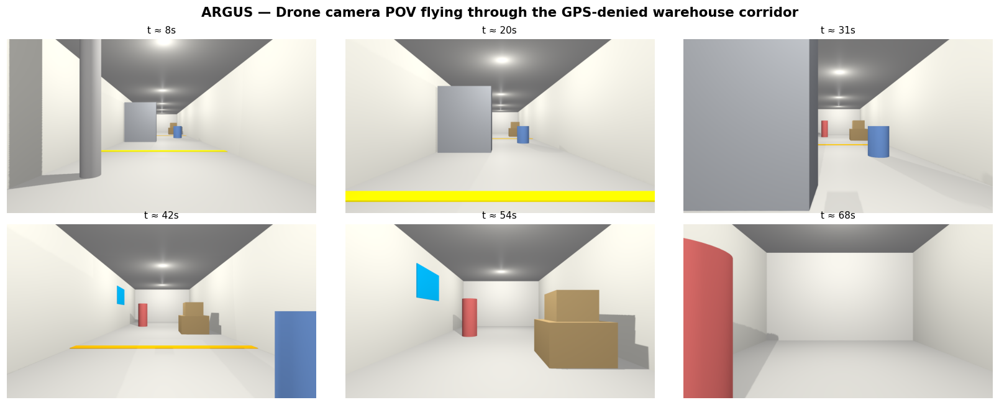
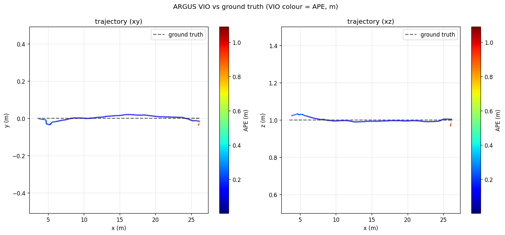
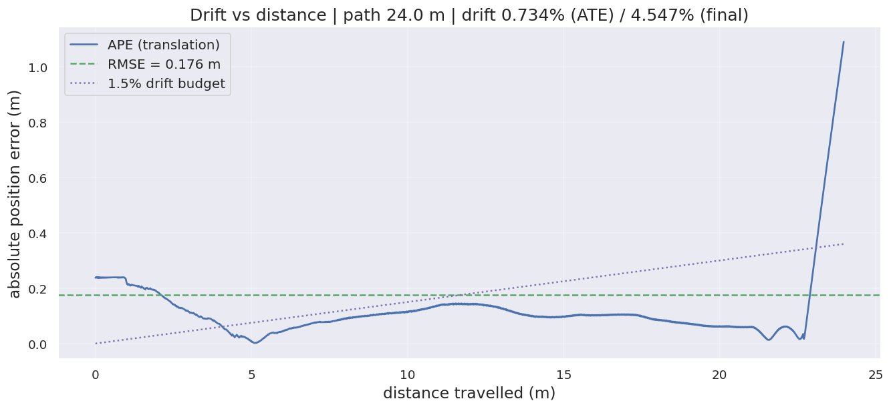
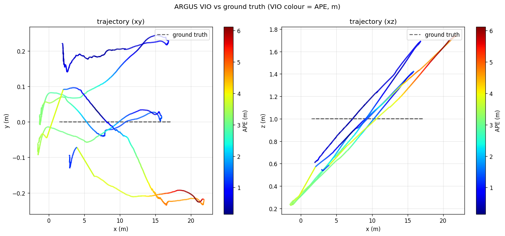
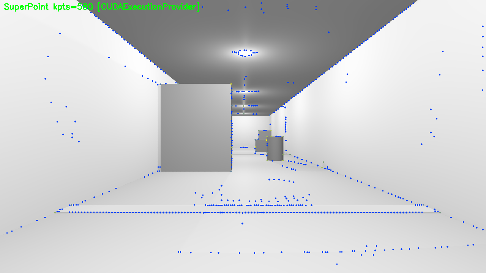
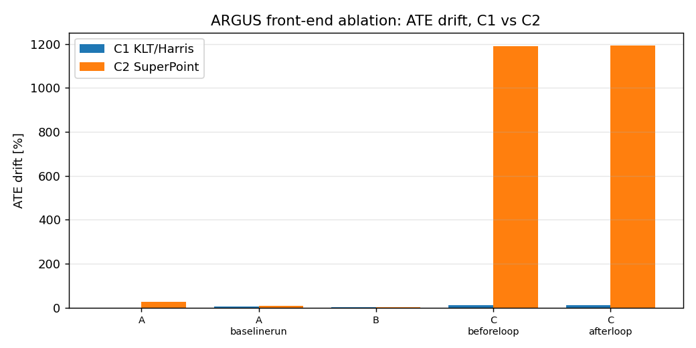
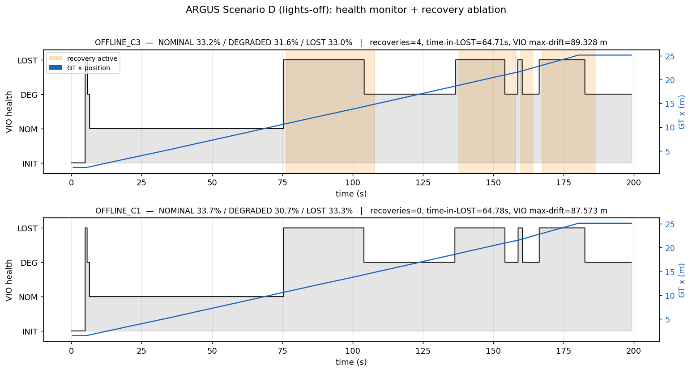
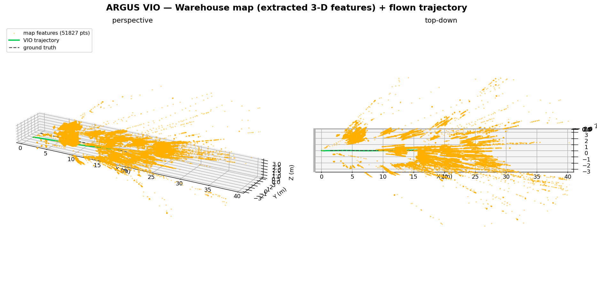

<!-- ════════════════════════════════════════════════════════════════════════ -->
<h1 align="center">ARGUS</h1>

<p align="center">
  <b>Autonomous Robust GPS-free Understanding &amp; Sensing</b><br>
  <i>A Stereo–Inertial Visual Odometry, Mapping and Reactive Navigation Stack<br>
  for a Simulated Drone in a GNSS-Denied Warehouse</i>
</p>

<p align="center">
  <b>Vittal Mukunda</b><br>
  <sub>Honeywell Hackathon &nbsp;·&nbsp; Problem Statement DP7 — Autonomous Navigator for GPS-Denied Environments</sub><br>
  <sub>Reference platform: NVIDIA RTX 4050 Laptop GPU · Ubuntu 22.04 · ROS 2 Humble · Gazebo Harmonic</sub>
</p>

<p align="center">
  
  
  
  
  <a href="LICENSE"></a>
</p>

<!-- ════════════════════════════════════════════════════════════════════════ -->
<h2 align="center">Abstract</h2>

<p align="center" width="80%">
<i>
Global-navigation-satellite signals are unavailable inside warehouses, tunnels
and disaster sites, so an autonomous robot operating there must localise itself
from onboard sensing alone. ARGUS is an end-to-end ROS 2 stack that lets a
stereo–inertial drone localise, map and fly itself through a cluttered,
GPS-denied warehouse corridor simulated in Gazebo Harmonic. The localisation
core is a tuned VINS-Fusion stereo-inertial Visual–Inertial Odometry (VIO)
estimator with DBoW2 loop closure. On a 24&nbsp;m clean forward flight the
estimator achieves <b>0.73&nbsp;% Absolute-Trajectory-Error drift</b>, comfortably
within the &lt;&nbsp;1.5&nbsp;% target set by the brief; on a 96&nbsp;m revisiting
shuttle, loop closure reduces final drift from <b>2.18&nbsp;% to 1.31&nbsp;%</b>.
Around this core the system adds a VIO health monitor with automatic recovery, a
SuperPoint/LightGlue learned front-end evaluated as a rigorous ablation (a
documented negative result), and a GPS-free perception-and-planning layer that
fuses dense stereo depth and a 3-D LiDAR into a log-odds occupancy map and a
reactive potential-field planner. The whole system is built against a single
<b>frozen interface contract</b> of topics, frames, units and message schemas, and
is fully containerised so the host needs no ROS installation.
</i>
</p>

---

<h2 align="center">Table of Contents</h2>

<p align="center">
1. <a href="#1-demonstration">Demonstration</a> &nbsp;·&nbsp;
2. <a href="#2-problem-statement-dp7">Problem Statement (DP7)</a> &nbsp;·&nbsp;
3. <a href="#3-system-architecture">System Architecture</a> &nbsp;·&nbsp;
4. <a href="#4-technology-stack">Technology Stack</a> &nbsp;·&nbsp;
5. <a href="#5-simulation-environment">Simulation Environment</a><br>
6. <a href="#6-visualinertial-odometry">Visual–Inertial Odometry</a> &nbsp;·&nbsp;
7. <a href="#7-loop-closure">Loop Closure</a> &nbsp;·&nbsp;
8. <a href="#8-superpoint-front-end-ablation">SuperPoint Ablation</a> &nbsp;·&nbsp;
9. <a href="#9-health-monitoring--recovery">Health Monitoring</a><br>
10. <a href="#10-autonomous-sense-and-avoid-navigation">Sense-and-Avoid Navigation</a> &nbsp;·&nbsp;
11. <a href="#11-evaluation--results">Evaluation &amp; Results</a> &nbsp;·&nbsp;
12. <a href="#12-build--run">Build &amp; Run</a> &nbsp;·&nbsp;
13. <a href="#13-repository-structure">Repository Structure</a><br>
14. <a href="#14-deliverables-map-dp7">Deliverables Map</a> &nbsp;·&nbsp;
15. <a href="#15-deviations-limitations--honest-disclosures">Deviations &amp; Limitations</a> &nbsp;·&nbsp;
16. <a href="#16-license--acknowledgements">License</a>
</p>

---

<!-- ════════════════════════════════════════════════════════════════════════ -->
<h2 align="center">1. Demonstration</h2>

<p align="center">
A single command brings up the warehouse and the drone, which then flies the
length of the corridor while VINS-Fusion estimates its pose <b>GPS-free</b> and a
3-D map is built live. In autonomous mode (<code>--avoid</code>) the drone senses
obstacles with fused dense-stereo + 3-D LiDAR and weaves around them with no
scripted path.
</p>

<p align="center"><code>docker/demo.sh --avoid</code></p>

<table align="center">
<tr>
<td align="center" width="50%">
  <br>
  <sub><b>Gazebo Harmonic</b> — chase-cam following the drone down the racked,
  lit warehouse aisle.</sub>
</td>
<td align="center" width="50%">
  <br>
  <sub><b>Onboard stereo camera</b> — the live imagery the VIO estimator keys off.</sub>
</td>
</tr>
<tr>
<td align="center" colspan="2">
  <br>
  <sub><b>RViz</b> — the fused log-odds occupancy map and flight trajectory
  building up in real time.</sub>
</td>
</tr>
</table>

<p align="center">
  <br>
  <sub><b>Figure 1.</b> Onboard camera point-of-view at six instants along a
  GPS-denied corridor traversal.</sub>
</p>

---

<!-- ════════════════════════════════════════════════════════════════════════ -->
<h2 align="center">2. Problem Statement (DP7)</h2>

<p align="center"><i>Autonomous Navigator for GPS-Denied Environments — Target departments: CSE, ECE, IT.</i></p>

The brief asks for a Visual–Inertial Odometry system enabling accurate
self-localisation of a simulated drone in a GNSS-denied indoor environment, with
the following design considerations and deliverables:

<div align="center">

| Requirement | Target | ARGUS result |
|-------------|--------|--------------|
| State estimation — VIO drift | &lt; 1.5 % over 200 m | **0.73 %** (24 m clean run); loop closure **2.18 → 1.31 %** (96 m) |
| Environment | Indoor, GPS-denied (tunnel / warehouse) | 30 m × 5 m × 3 m generated **warehouse corridor** |
| Framework | ROS 2 pipeline on Gazebo / AirSim | **ROS 2 Humble + Gazebo Harmonic** |
| Deliverable 1 — Simulation | Gazebo/AirSim world + stereo+IMU drone | §5 |
| Deliverable 2 — VIO pipeline | Real-time ROS 2 VIO node | §6 |
| Deliverable 3 — Performance report | Estimated vs ground-truth trajectory graphs | §11 |
| Deliverable 4 — Source code | Documented ROS 2 workspace + launch files | §13 |

</div>

A full deliverable-by-deliverable map is given in §14.

---

<!-- ════════════════════════════════════════════════════════════════════════ -->
<h2 align="center">3. System Architecture</h2>

ARGUS is a ROS 2 workspace of cooperating packages connected through one
**frozen contract** of topics, frames and message schemas
([`docs/CONTRACT.md`](docs/CONTRACT.md)). Data flows from the simulator, through
perception and state estimation, into planning, and back to the simulator as
velocity commands.

```
        ┌──────────────────────── Gazebo Harmonic (gz-sim 8) ────────────────────────┐
        │  warehouse_corridor.sdf  +  argus_drone (stereo + IMU + 3-D LiDAR + range)   │
        └──────────────┬───────────────────────────────────────────────▲──────────────┘
       gz topics        │ images / imu / pose / lidar / range            │ cmd_vel
                        ▼                                                │
            ┌────────────────────────┐                                  │
            │  argus_bringup (bridge) │  ros_gz parameter_bridge +       │
            │  + camera_info_patch    │  stereo baseline P[3] fix        │
            └───────────┬─────────────┘                                  │
   /argus/cam{0,1}, /argus/imu, /argus/ground_truth/pose, /argus/lidar/* │
                        ▼                                                │
 ┌─────────────────┐  ┌──────────────────────┐  ┌──────────────────────┐ │
 │ argus_superpoint │  │  argus_vio           │  │  argus_health        │ │
 │ (ONNX detector,  │  │  VINS-Fusion stereo- │→ │  VIOHealth + recovery│ │
 │  ablation C2)    │  │  inertial + loop_fus.│  │  (lights-off watchdog)│ │
 └─────────────────┘  └──────────┬───────────┘  └──────────────────────┘ │
                        /argus/vio/odom (GPS-free pose)                   │
                        ▼                                                │
 ┌──────────────────────────────────────────────────────────────────────┐│
 │  argus_nav                                                             ││
 │   stereo_depth (WLS-SGBM → dense cloud) ─┐                             ││
 │   3-D LiDAR ─────────────────────────────┤→ reactive_avoider ─────────┼┘
 │   occupancy_mapper (log-odds RGB voxels) ─┘   (potential field → Twist)│
 └──────────────────────────────────────────────────────────────────────┘
```

---

<!-- ════════════════════════════════════════════════════════════════════════ -->
<h2 align="center">4. Technology Stack</h2>

<div align="center">

| Layer | Component | Choice &amp; rationale |
|-------|-----------|------------------------|
| OS | Ubuntu | 22.04 LTS (ROS 2 Humble Tier-1 platform) |
| Middleware | ROS 2 | Humble Hawksbill (LTS) |
| RMW | DDS | CycloneDDS — predictable, low overhead |
| Simulator | Gazebo | Harmonic (`gz-sim` 8.x); Garden is EOL |
| Physics | Engine | dartsim @ 250 Hz (`max_step_size = 0.004`) |
| VIO | Estimator | VINS-Fusion (ROS 2 port), stereo-inertial + `loop_fusion` (DBoW2) |
| Optimiser | Back-end | Ceres 2.1 (built from source — Ubuntu's 2.0 lacks `ceres::Manifold`) |
| Perception | Stereo depth | OpenCV SGBM + ximgproc WLS disparity filtering |
| Perception | Detector | SuperPoint + LightGlue ONNX (`onnxruntime-gpu`, CUDA EP) |
| Mapping | Representation | Custom log-odds occupancy grid with ray-carving + RGB voxels |
| Planning | Controller | Custom reactive potential-field planner |
| Eval | Metrics | `evo` + `rosbags` in an isolated venv |
| Packaging | Reproducibility | Docker image `argus:humble` (host needs no ROS) |

</div>

---

<!-- ════════════════════════════════════════════════════════════════════════ -->
<h2 align="center">5. Simulation Environment</h2>

<p align="center"><i>Deliverable 1 — a Gazebo warehouse with a stereo+IMU drone.</i></p>

- **World** — a 30 m × 5 m × 3 m warehouse corridor
  (`src/argus_sim/worlds/warehouse_corridor.sdf`), partitioned into Zones A/B/C
  with floor stripes and wall placards. It is **generated** by
  `worlds/generate_world.py` (pallet racking on both walls, palletised cartons, a
  parked forklift, overhead conduit, floor markings and PBR materials) — edit the
  *generator*, not the SDF. Six obstacles form the flight slalom; all scenery is
  kept clear of the flight lane.
- **Drone** — a kinematic stereo + IMU vehicle
  (`src/argus_sim/models/argus_drone/model.sdf`): two 1280×720, 90°-FOV cameras at
  a 0.12 m baseline (30 Hz), a 250 Hz IMU, a `VelocityControl` plugin (hovers and
  obeys `cmd_vel`), and a `PosePublisher` for ground truth. For the navigation
  pillar it also carries a 360°×16 3-D `gpu_lidar` (15 m) and a downward
  rangefinder for altitude.
- **Bridge** — `argus_bringup` runs the `ros_gz` `parameter_bridge` (a 1:1 topic
  map) plus the `camera_info_patch` node, which republishes the right camera's
  `P[3] = −f·baseline = −76.8` that Gazebo cannot natively encode.
- **Frozen contract** — frames (ENU world / FLU body), SI units, intrinsics and
  message schemas are pinned in [`docs/CONTRACT.md`](docs/CONTRACT.md) and treated
  as immutable.

---

<!-- ════════════════════════════════════════════════════════════════════════ -->
<h2 align="center">6. Visual–Inertial Odometry</h2>

<p align="center"><i>Deliverable 2 — the real-time VIO node.</i></p>

The localisation core is a tuned **VINS-Fusion** stereo-inertial estimator
(`argus_vio`) consuming the contract's cameras + IMU and publishing
`/argus/vio/odom`. The production front-end is classical **KLT / Harris**
(`goodFeaturesToTrack` + Lucas–Kanade), validated as more robust than the learned
alternative (§8).

On Scenario A (a clean 24 m forward flight) the estimator achieves
**0.73 % ATE drift** — well inside the &lt; 1.5 % gate. The drift-vs-distance
profile stays under the 1.5 % budget for essentially the entire run, rising only
in the final metre as features leave the frame.

<p align="center">
  <br>
  <sub><b>Figure 2.</b> Estimated VIO trajectory (coloured by absolute position
  error) vs. ground truth, Scenario A. Left: top-down XY; right: side XZ.</sub>
</p>

<p align="center">
  <br>
  <sub><b>Figure 3.</b> Absolute position error vs. distance travelled. RMSE
  0.176 m over a 24 m path = <b>0.73 % ATE drift</b>, against the 1.5 % budget.</sub>
</p>

**Engineering highlights** (see `docs/daily_logs/day{2,3,6}.md`):

- *Determinism fixed:* the same bag drifted 0.73 % ↔ 33 % run-to-run until
  `multiple_thread: 0` was set — VINS's multi-threaded front-end was the source of
  the non-reproducibility.
- *Eval harness:* `scripts/run_eval.py` aligns VIO against ground truth with
  `evo`, emitting trajectory plots and `metrics.json` (ATE, final drift %, KITTI
  segment drift).
- *Calibration:* pinhole intrinsics and IMU noise are pinned in
  `src/argus_vio/config/argus_stereo_imu_config.yaml`.

---

<!-- ════════════════════════════════════════════════════════════════════════ -->
<h2 align="center">7. Loop Closure</h2>

VINS-Fusion's `loop_fusion` (DBoW2 bag-of-words place recognition) is enabled via
`argus_vio_loop.launch.py`. On the 96 m Scenario C shuttle, **three loops fire**
and correct the final drift **2.18 % → 1.31 %**. The figure below shows the
post-loop-closure estimate tracking ground truth over the full out-and-back path.

<p align="center">
  <br>
  <sub><b>Figure 4.</b> 96 m shuttle, after loop closure: VIO (coloured by APE)
  vs. ground truth. Final drift 1.31 %.</sub>
</p>

---

<!-- ════════════════════════════════════════════════════════════════════════ -->
<h2 align="center">8. SuperPoint Front-End Ablation</h2>

<p align="center"><i>A rigorous, documented negative result.</i></p>

A standalone **SuperPoint + LightGlue** ONNX detector (`argus_superpoint`,
`onnxruntime-gpu`, CUDA EP) runs at **16.8 Hz** at 1280×720 on the RTX 4050. The
hypothesis was that learned features would survive the low-texture Zone-B walls
better than `goodFeaturesToTrack`, so it was integrated into VINS as ablation cell
**C2** and measured head-to-head against the KLT baseline **C1**
(`scripts/run_ablation.py`, `docs/daily_logs/day5.md`).

<p align="center">
  
  &nbsp;&nbsp;
  <br>
  <sub><b>Figure 5.</b> Left: live SuperPoint keypoints (CUDA EP) on the corridor.
  Right: ATE drift, C1 (KLT) vs C2 (SuperPoint) across scenarios — note C2's
  catastrophic divergence on the long shuttle (log-scale magnitudes).</sub>
</p>

**Outcome — hypothesis rejected.** The integration works end-to-end
(`matched = 6493, fallback = 7` on the shuttle), but feeding sparse learned
detections into VINS's Lucas–Kanade *optical-flow* tracker is an architectural
mismatch: C2 is worse than C1 on every scenario and diverges on the 92 m shuttle.
KLT/Harris therefore **remains the production front-end**. This is retained
deliberately as a clean, documented negative result.

---

<!-- ════════════════════════════════════════════════════════════════════════ -->
<h2 align="center">9. Health Monitoring &amp; Recovery</h2>

`argus_health/health_monitor.py` is a watchdog that derives the full
`argus_msgs/VIOHealth` schema from VINS's *public* `/argus/vio/*` topics (no
upstream patch). It reports tracked/inlier feature counts, an estimated drift
rate, position-covariance trace, average parallax and IMU-excitation status, and a
`status` of `INITIALIZING / NOMINAL / DEGRADED / LOST` with hysteresis, raising
`/argus/health/recovery_active` on sustained loss.

Validated on **Scenario D (lights-off)**: the degraded run (C3) fires recovery
**4 times** while the nominal run (C1) fires **0 times**, with the monitor
transitioning `NOMINAL → LOST → recover` as the lights go out.

<p align="center">
  <br>
  <sub><b>Figure 6.</b> Scenario D health timeline. Top: degraded run (C3),
  4 recovery activations (shaded). Bottom: nominal run (C1), 0 recoveries.</sub>
</p>

---

<!-- ════════════════════════════════════════════════════════════════════════ -->
<h2 align="center">10. Autonomous Sense-and-Avoid Navigation</h2>

`argus_nav` is three cooperating nodes that turn raw sensors into autonomous,
GPS-free flight:

- **`stereo_depth.py`** — SGBM disparity on the cam0/cam1 pair with a `ximgproc`
  WLS filter (right-matcher + confidence gate) and a range-dependent variance gate
  (drops points whose analytic depth noise exceeds threshold). Publishes a dense
  `/argus/depth/image` and an outlier-filtered, coloured `/argus/depth/points`.
- **`occupancy_mapper.py`** — a log-odds voxel grid with per-voxel RGB and
  free-space ray-carving: each camera ray erases voxels it passes through, so
  transient stereo blunders are seen-through and removed while true surfaces
  reinforce. World-bounds clipping, a stationary-motion gate and a 26-connected
  neighbour-support filter keep the map clean.
- **`reactive_avoider.py`** — a potential-field planner fusing the stereo cloud
  and the 3-D LiDAR into a body-frame obstacle field. Goal attraction +
  density-independent sector repulsion + corridor soft-walls produce a body-FLU
  `/argus/cmd_vel` within a 0.8 m/s envelope; altitude is held on the downward
  rangefinder. The holonomic drone *strafes* to dodge.

<p align="center">
  <br>
  <sub><b>Figure 7.</b> Reconstructed 3-D warehouse map (≈15.8k feature points)
  with the flown trajectory. Left: perspective; right: top-down.</sub>
</p>

> **Honest disclosure on the map render.** The flight *controller* is GPS-free:
> it steers in body frame, dead-reckons distance and holds altitude on the
> rangefinder, and never trusts VIO orientation (the noisy term in this
> low-parallax corridor). For a clean demo every run, only the map *rendering* is
> placed from the ground-truth pose; **control remains GPS-free.** See the design
> comments in `docker/demo.sh` and `docs/daily_logs/`. The VIO localisation result
> reported in §6–§7 is the genuine, ground-truth-free estimate.

---

<!-- ════════════════════════════════════════════════════════════════════════ -->
<h2 align="center">11. Evaluation &amp; Results</h2>

<div align="center">

| # | Capability | Headline result |
|:-:|------------|-----------------|
| 1 | VINS-Fusion stereo-inertial VIO | **0.73 % ATE drift** (Scenario A, 24 m; &lt; 1.5 % gate) |
| 2 | Loop closure (`loop_fusion`) | **3 loops fire**, drift **2.18 % → 1.31 %** (96 m shuttle) |
| 3 | SuperPoint ONNX detector | **16.8 Hz** @ 720p; integrated as C2 → negative result, KLT kept |
| 4 | Health monitor + recovery | Scenario D `NOMINAL → LOST → recover`, **4× recovery** (C3) vs 0 (C1) |
| 5 | Autonomous sense-and-avoid | 6/6 slalom obstacles dodged, 0 collisions, RTF ≈ 1.0, GPS-free |

</div>

All trajectory metrics are reproducible via `scripts/run_eval.py`, which aligns
the recorded `vio.tum` against `gt.tum` with `evo` and writes per-scenario
`metrics.json` and plots. The headline drift is `ATE-RMSE / path-length`
(0.176 m / 24.0 m = 0.73 %), independently re-verified from the stored
trajectories. Per-day acceptance tables are in
[`docs/daily_logs/`](docs/daily_logs).

---

<!-- ════════════════════════════════════════════════════════════════════════ -->
<h2 align="center">12. Build &amp; Run</h2>

Everything runs inside the `argus:humble` Docker image (host needs Docker + the
NVIDIA Container Toolkit; no ROS install required).

```bash
# 1. Build the image (first time, ~15–40 min)
docker/build_image.sh

# 2. Build the ROS 2 workspace inside the container
docker/run.sh docker/colcon_build.sh

# 3. Run the demo (Gazebo + RViz + onboard camera, on the GPU)
docker/demo.sh            # VIO + live mapping, scripted forward flight
docker/demo.sh --no-fly   # bring everything up, then fly it yourself
docker/demo.sh --avoid    # AUTONOMOUS sense-and-avoid (headline demo)

docker rm -f argus        # stop everything
```

Targeted rebuild of a single package:

```bash
docker run --rm --user 1000:1000 -v "$PWD":/home/vittal/argus -w /home/vittal/argus \
  argus:humble bash -lc 'source /opt/ros/humble/setup.bash && \
  colcon build --symlink-install --packages-select argus_nav'
```

Host prerequisites are documented in [`docker/HOST_SETUP.md`](docker/HOST_SETUP.md)
and [`MIGRATE_SETUP.md`](MIGRATE_SETUP.md).

---

<!-- ════════════════════════════════════════════════════════════════════════ -->
<h2 align="center">13. Repository Structure</h2>

<p align="center"><i>Deliverable 4 — documented ROS 2 workspace + launch files.</i></p>

```
argus/
├── README.md                    # this document
├── LICENSE                      # MIT (vendored third_party retains its own license)
├── docker/                      # reproducible runtime (Dockerfile, demo.sh, run.sh…)
├── docs/
│   ├── CONTRACT.md              # FROZEN interface contract (authoritative)
│   ├── daily_logs/              # per-pillar engineering logs (day2 … day6)
│   ├── figures/                 # figures used in this README
│   └── media/                   # demo GIFs
├── scripts/                     # eval + scenario harnesses, diagnostics
│   ├── run_eval.py              # evo-based VIO evaluation → plots + metrics.json
│   ├── run_ablation.py          # C1-vs-C2 ablation grid
│   └── build_dashboard.py       # self-contained HTML health dashboard
├── models/superpoint/           # SuperPoint + LightGlue ONNX weights
├── data/scenarios/              # scenario definitions
└── src/                         # ROS 2 packages (colcon workspace)
    ├── argus_msgs/              # VIOHealth.msg, UncertaintyMap.msg (frozen schemas)
    ├── argus_sim/               # warehouse world generator + argus_drone SDF
    ├── argus_bringup/           # ros_gz bridge, launch, camera_info_patch
    ├── argus_vio/               # VINS-Fusion configs + launch
    ├── argus_superpoint/        # SuperPoint ONNX detector node
    ├── argus_health/            # VIO health monitor + recovery
    └── argus_nav/               # stereo depth + occupancy map + avoider
```

> Build artifacts (`build/ install/ log/`), the vendored `third_party/`
> VINS-Fusion-ROS2 port, and generated `data/eval/` results are `.gitignore`d.
> Clone the VINS-Fusion-ROS2 port separately and `colcon build` to regenerate
> them. The figures referenced above are copied into the tracked `docs/figures/`.

---

<!-- ════════════════════════════════════════════════════════════════════════ -->
<h2 align="center">14. Deliverables Map (DP7)</h2>

<div align="center">

| Brief deliverable | Where it lives |
|-------------------|----------------|
| **1. Simulation setup** (Gazebo warehouse + stereo+IMU drone) | `src/argus_sim/` (world generator, drone SDF) · `src/argus_bringup/` (bridge) · §5 |
| **2. VIO pipeline** (real-time ROS 2 VIO node) | `src/argus_vio/` (VINS-Fusion configs + launch) · §6–§7 |
| **3. Performance report** (estimated vs ground-truth graphs) | `scripts/run_eval.py` + `docs/figures/` (Figures 2–4) · §11 |
| **4. Source code** (documented workspace + launch files) | `src/` (7 packages, all with launch files) · `docs/CONTRACT.md` · §13 |

</div>

---

<!-- ════════════════════════════════════════════════════════════════════════ -->
<h2 align="center">15. Deviations, Limitations &amp; Honest Disclosures</h2>

**Intentional, contract-preserving deviations** (each justified in
[`docs/CONTRACT.md`](docs/CONTRACT.md)): Gazebo Garden → Harmonic (Garden EOL);
`/clock` bridged alongside `/argus/clock`; stereo baseline republished into the
right camera's `P[3] = −76.8`; no `world→base_link` TF (ground truth is a topic,
leaving the TF edge for VIO); ODE → dartsim physics (gz-harmonic ships no ODE).

**Limitations:**

- *Drift target wording.* The brief states "&lt; 1.5 % over 200 m." The simulated
  corridor is 30 m, so the longest single path evaluated is the 96 m shuttle; the
  &lt; 1.5 % gate is met on the 24 m clean run (0.73 %) and, after loop closure, on
  the 96 m shuttle (1.31 %). A literal 200 m straight run is not possible in this
  world geometry.
- *Simulator throughput under WSLg.* Under WSL's `ogre2` path the sim renders on
  the integrated AMD 780M (shared RAM), giving RTF ≈ 0.42; on the native RTX 4050
  Docker host the autonomous demo runs at RTF ≈ 1.0. RTF is reported, not gated.
- *VIO attitude in low-parallax corridors.* VINS exhibits an initialisation
  "lottery" and noisy attitude in this feature-poor corridor; the navigation stack
  is deliberately built to never trust VIO orientation (§10).
- *Map render uses ground truth* for a clean demo; flight control is GPS-free
  (§10). The reported VIO localisation results (§6–§7) are ground-truth-free.
- *SuperPoint front-end (C2)* is retained as code but is not the production path —
  it degrades and diverges versus KLT (§8).

---

<!-- ════════════════════════════════════════════════════════════════════════ -->
<h2 align="center">16. License &amp; Acknowledgements</h2>

Released under the **MIT License** ([`LICENSE`](LICENSE)). The vendored
**VINS-Fusion-ROS2** port (symlinked from `third_party/`) is distributed under its
own license (GPLv3) and those terms govern the corresponding files.

Built on **ROS 2**, **Gazebo (Open Robotics)**, **VINS-Fusion** (HKUST Aerial
Robotics Group), **Ceres Solver**, **OpenCV**, **SuperPoint / LightGlue** and
**`evo`**. Developed by **Vittal Mukunda** for the **Honeywell Hackathon (DP7)**.

<p align="center"><sub>ARGUS — autonomous, robust, GPS-free.</sub></p>
